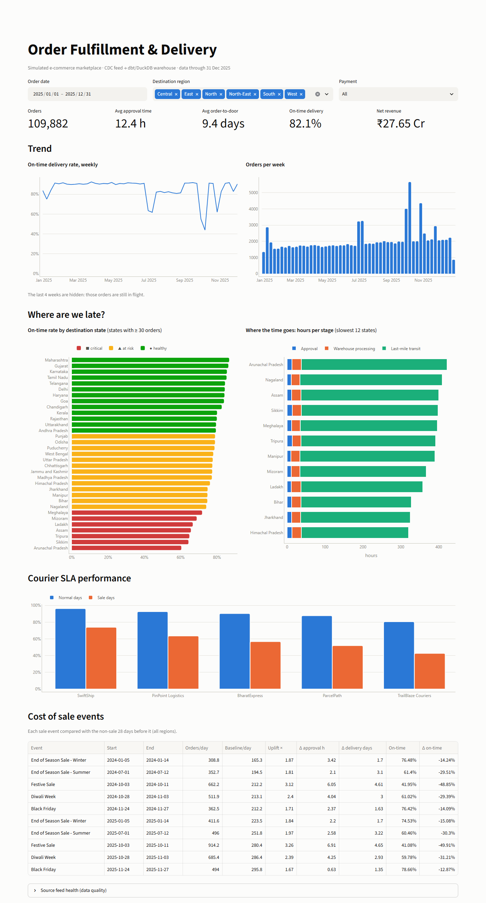

# Order Fulfillment Analytics

[](https://github.com/unboundedraj/order-fulfillment-analytics/actions/workflows/ci.yml)


A delivery-analytics platform for an Indian e-commerce marketplace. It starts with the order
management system's **daily CDC extracts**, which arrive late, duplicated and dirty, and
produces a tested **dbt star schema**, KPI marts that explain *where and why deliveries are
late*, Dagster orchestration, and a Streamlit dashboard.

> Built on top of the original Tableau dashboard work by
> [@tfkhushij](https://github.com/tfkhushij/Order-Fulfilment-Dashboard) (approval-time,
> delivery-time and state-level fulfilment KPIs). This project rebuilds those KPIs as a
> reproducible, incrementally maintained data pipeline.



## What it does

```
 simulator ──▶ landing/ (daily CDC CSVs) ──▶ raw (append-only) ──▶ staging ──▶ intermediate ──▶ core (star) ──▶ kpi ──▶ dashboard
  seeded        late + duplicate rows,       manifest-tracked,     dedup,      SCD2 history,     incremental     scorecards,
  2 yrs         dirty states, clock skew     idempotent loads      typing      point-in-time     fact + contract  bottlenecks
                                                                                joins                             courier SLA
                       ▲──────────────────── Dagster: assets · 87 asset checks · schedule · sensor ────────────────────▲
```

| | |
|---|---|
| Volume (default run) | 190,949 orders · **764,479 CDC rows** · 2,875 extract files · 2 years |
| Full pipeline (generate, load, 27 models, 130 dbt nodes) | **~1.5 min** on a laptop |
| Incremental day | loads only new files (a no-op load checks all 2,875 files in about 1 s) and rebuilds only touched orders |
| Feed problems handled | 3,802 re-sent duplicates · 14,940 late-arriving versions · 504 clock-skew anomalies · 6% misspelt states · 2,406 customer moves |
| Correctness | incremental `fct_orders` **equals a full refresh** (asserted in CI); revenue reconciles to the rupee for settled orders |

## Data engineering highlights

- **CDC-aware modelling.** The current order state is the latest version by **event time**,
  so late rows never overwrite newer ones. Status history is **SCD2 built from the log**
  rather than from snapshots.
- **Incremental fact driven by load time** (`delete+insert` on `order_id`). Any order touched
  by any new row is rebuilt, however old it is. See
  [`fct_orders.sql`](dbt/models/marts/core/fct_orders.sql).
- **Point-in-time joins.** Orders keep the customer's state *as of purchase* via the SCD2
  `dim_customers` (`customer_sk`).
- **Enforced model contract** on the fact table, plus dbt **unit tests** for the trickiest
  logic: late-arrival resolution and PIT attribution.
- **Quality gates:** source freshness, 95 data tests, custom generic tests
  (`scd2_no_overlaps`, `timestamps_in_order`, ...), completeness and **financial
  reconciliation** tests with a settlement window derived from business rules.
- **Idempotent ingestion.** The loader keeps a manifest, reads each entity's new files in one
  multi-file scan inside one transaction, and flags files modified after load. Raw rows carry
  lineage (`_source_file`, `_load_id`).
- **Observability:** dbt `run_results` are persisted to `ops.dbt_run_results`. A
  `mart_data_quality_daily` tracks duplicates, late-arrival rate and a volume z-score for
  the feed itself.
- **Orchestration:** Dagster software-defined assets from landing files to KPI marts, with
  dbt tests as asset checks, a daily schedule and a new-extract sensor.
- **Engineering hygiene:** ruff, sqlfluff (duckdb dialect), and pytest, including end-to-end
  dbt builds. CI runs a full-size pipeline and publishes the dbt docs site as an artifact.

## What the data says

From [`docs/findings.md`](docs/findings.md):

- The **North-East** is 16.4 days order-to-door at 69.6% on time, against 7.9 days and 86.2%
  in the West. **Last-mile transit is the bottleneck in 24 of 33 states.**
- **Cross-region shipments** take 10.7 days against 5.7 days in-region, so inventory
  placement matters more than courier choice.
- The **Festive Sale** triples volume and drops on-time by about 49 points. **COD** orders
  take 18.4 h to approve against 10.1 h for prepaid and are returned to origin twice as often.

## Quickstart

```bash
python -m venv .venv && source .venv/bin/activate          # Windows: .venv\Scripts\activate
pip install -e ".[orchestration,dashboard,dev]"

python -m fulfillment run              # simulate 2 years -> load -> dbt seed + build
python -m fulfillment status           # loads, table sizes, last dbt run
streamlit run dashboard/app.py         # http://localhost:8501
```

Watch the incremental path:

```bash
python -m fulfillment run --until 2025-06-30   # first 18 months only
python -m fulfillment advance --days 7         # next week arrives -> loaded and built incrementally
```

Orchestrate and explore:

```bash
dagster dev -m fulfillment.orchestration.definitions          # http://localhost:3000
cd dbt && dbt docs generate --profiles-dir . && dbt docs serve --profiles-dir .   # lineage graph
```

Test:

```bash
pytest                   # unit + end-to-end (dbt builds on a small simulated dataset)
pytest -m "not e2e"      # fast subset
sqlfluff lint dbt/models
```

## Project layout

```
src/fulfillment/
  generator/      reference data, lifecycle simulator, landing writer, seed export
  loader.py       incremental raw loader + manifest
  transform.py    in-process dbt runner, run_results -> ops schema
  orchestration/  Dagster definitions
  cli.py          generate | load | transform | run | advance | status
dbt/
  models/staging       stg_orders__cdc, stg_customers__cdc, ...
  models/intermediate  int_orders__latest, int_customers__scd2, int_orders__lifecycle, ...
  models/marts/core    fct_orders (incremental, contract), dims, SCD2 dim_customers
  models/marts/kpi     state scorecard, bottlenecks, courier SLA, sale impact, funnel, DQ
  tests/               custom generic + singular reconciliation tests
  seeds/               states, aliases, sale calendar, hubs, couriers
dashboard/app.py       Streamlit + Plotly
docs/                  architecture, data model, decisions, findings
```

## Documentation

- [Architecture and late-data handling](docs/architecture.md)
- [Data model and KPI definitions](docs/data_model.md)
- [Design decisions](docs/decisions.md)
- [Findings](docs/findings.md)

## Data disclaimer

All data is **synthetic**, generated by `fulfillment.generator` and calibrated to the original
dashboard's KPI ranges. Courier and seller names are fictional, and nothing reflects any real
company's operations.
