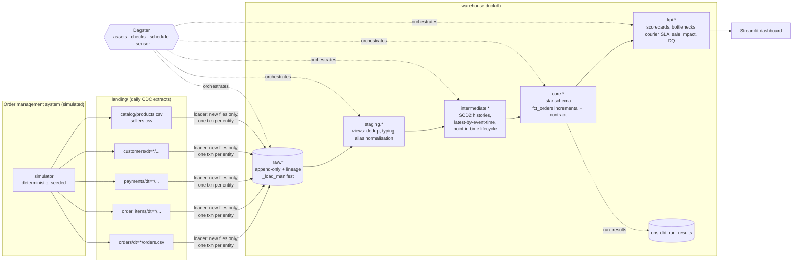

# Architecture

## Layers

| Layer | Materialisation | Responsibility |
|---|---|---|
| landing | CSV files, `dt=` partitions | What the source sent, published atomically (`.tmp` then rename) |
| `raw` | append-only tables | Faithful copy plus `_source_file`, `_loaded_at`, `_load_id`. `_load_manifest` makes loading idempotent and detects files changed after load |
| `staging` | views | Types, exact-duplicate removal, late-arrival flags, state-alias normalisation |
| `intermediate` | tables | Latest order version **by event time**, SCD2 status and customer histories, lifecycle durations with a **point-in-time** customer join |
| `core` | tables, `fct_orders` incremental | Star schema: `fct_orders`, `fct_order_items`, `fct_order_status_history`, `dim_customers` (SCD2), `dim_date`, `dim_geography`, `dim_products`, `dim_hubs` |
| `kpi` | tables | Business-facing marts consumed by the dashboard (declared as a dbt exposure) |

## How late and duplicate data is handled

| Problem in the feed | Where it is handled | How |
|---|---|---|
| Same version re-sent | `stg_orders__cdc` | `row_number()` over (order, status, updated_at); copies are counted, not silently lost |
| Version arrives days late | `int_orders__latest` | Current state = latest **`updated_at`**, never latest arrival |
| Late row for an old order | `fct_orders` (incremental) | Rows are selected by **load time** (`source_last_loaded_at`), so any order touched by any new row is rebuilt, however old it is |
| Customer moved state | `int_customers__scd2` → `fct_orders.customer_sk` | Half-open validity intervals; orders join the version valid at purchase time |
| Dirty state names | `stg_customers__cdc` | `state_aliases` seed (e.g. "Tamilnadu", "Orissa", "J&K"); unmapped values are caught by a relationships test |
| Courier clock skew (delivered before shipped) | `int_orders__lifecycle` | Flagged with `has_timestamp_anomaly`, excluded from duration KPIs, and the ordering test skips flagged rows |
| Refund lands before the "returned" status | revenue reconciliation test | Only *settled* orders are reconciled (return window + max lateness + refund lag) |

## Quality gates

- **Source freshness** on every raw table (warn after 1 day, error after 3).
- **95 data tests**: unique, not_null, relationships, accepted_values, plus custom generic tests
  (`timestamps_in_order`, `value_between`, `positive_value`, `scd2_no_overlaps`,
  `one_current_row_per_key`, `unique_combination`).
- **Singular tests** for completeness (every source order reaches the fact), revenue
  reconciliation, and marts adding back up to the fact.
- **2 dbt unit tests** for the trickiest logic: late-arrival resolution and point-in-time
  attribution with SLA flags.
- **Enforced model contract** on `fct_orders`: names, types and not-null constraints.
- `pytest` proves the **incremental fact equals a full refresh** after new data arrives.

## Orchestration (Dagster)

`landing_extracts` → `raw/*` (multi-asset) → one asset per dbt node. All dbt tests show up
as **asset checks** (87). Jobs: `refresh_all` and `load_and_transform`. There is a daily
schedule (06:00 IST) and a sensor that starts a load and build when a new extract day lands.
