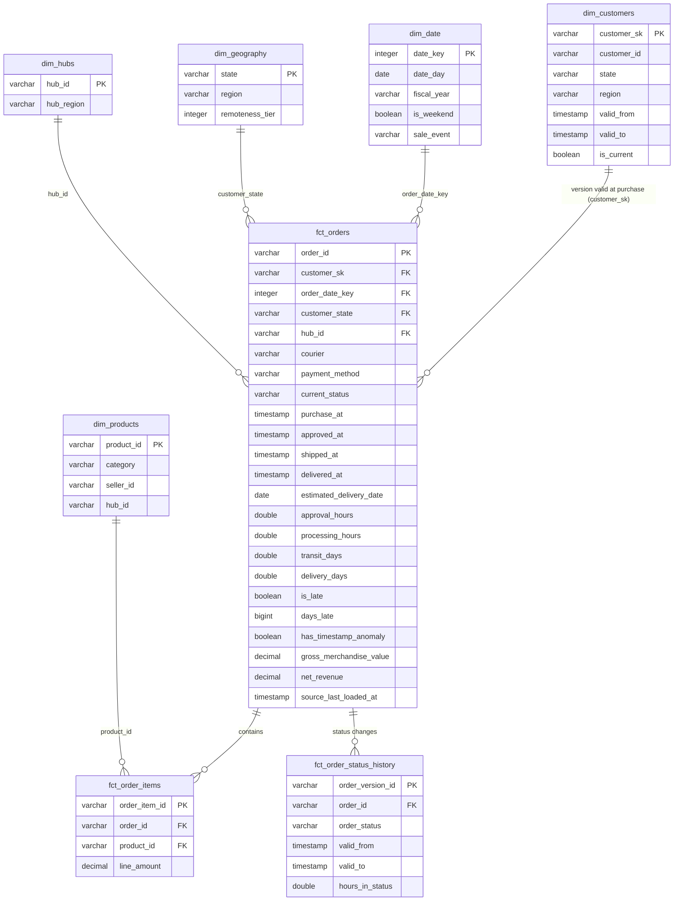

# Data model (core schema)

## Grain and keys

| Table | Grain | Key | Notes |
|---|---|---|---|
| `fct_orders` | order (current state) | `order_id` | incremental `delete+insert`; contract enforced |
| `fct_order_items` | order line | `order_item_id` | |
| `fct_order_status_history` | order × status interval | `order_version_id` | SCD2 built from the CDC log |
| `dim_customers` | customer × address version | `customer_sk` | SCD2; exactly one `is_current` row per customer (tested) |
| `dim_date` | day | `date_key` (yyyymmdd) | Indian FY (Apr–Mar) and sale flags |

## KPI definitions

| KPI | Definition |
|---|---|
| Approval time | `approved_at - purchase_at` in hours |
| Processing time | `shipped_at - approved_at` in hours (warehouse pick, pack and handover) |
| Transit time | `delivered_at - shipped_at` in days; null when timestamps are anomalous |
| Order-to-door | `delivered_at - purchase_at` in days |
| On-time rate | delivered orders whose delivery date ≤ the promised date shown at checkout |
| RTO rate | orders returned to origin (undeliverable) / all orders |
| Bottleneck stage | the stage with the largest excess hours over the national average, per state |
| Net revenue | charges − refunds (COD is charged on delivery) |
